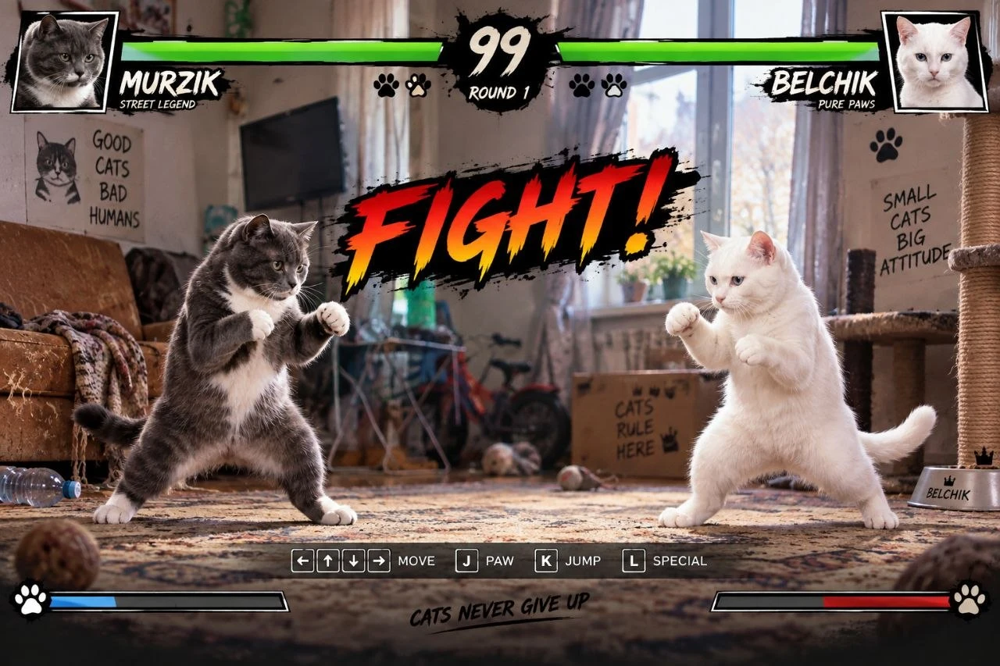

# Cat Fighter 🐾

2D-файтинг про двух домашних котов — **Мурзик** против **Бельчика**.
Сделан на Unity с нуля с помощью AI-инструментов: графика, звук и код — через генерацию и работу в паре с AI.



## Что умеет

- Покадровые анимации: удары лапами, пинок, блок, присед-уворот, лёгкая и тяжёлая реакция на удар, нокаут
- ИИ-противник со «характером»: агрессия, шанс блока и уворота, случайный темп
- Раунды до двух побед, таймер, нокаут с замедлением времени
- HUD в стиле заставки: портреты, реагирующие на удары, полоски здоровья со «шлейфом» урона, счёт раундов
- Финальный экран с пульсирующей кнопкой (CTA)
- Звук: удары, свист, блок, свой голос у каждого кота, музыка

## Управление

| Клавиша | Действие |
|---|---|
| A / D | шаг |
| J / U | удар правой / левой лапой |
| K | удар ногой |
| H (держать) | блок |
| S (держать) | пригнуться (уворот от пинка) |

## Как устроено

| Скрипт | Роль |
|---|---|
| `Fighter` | «тело» бойца: здоровье, движение, атаки, стойки. Не знает, кто им управляет |
| `PlayerController` / `FighterAI` | «руки» игрока и «мозг» компьютера — отдают бойцу одни и те же команды |
| `SpriteFramePlayer` | лёгкий проигрыватель покадровой анимации вместо Animator |
| `RoundManager` | «судья»: раунды, таймер, счёт |
| `BattleHUD` | интерфейс, строится из кода |
| `SoundManager` | звук по событиям бойцов |

## Пайплайн ассетов

```
AI-генерация листа  →  SourceArt/<Кот>/*_sheet.png
                    →  python Tools/slice_sprites.py <кот>   (нарезка, выравнивание по полу, единый масштаб)
                    →  Assets/Art/<Кот>/
                    →  Unity: Cat Fighter → Настроить бойцов  (клипы, позы, интерфейс, звук — одной кнопкой)
```

Unity 6 (6000.6), URP, Input System.
